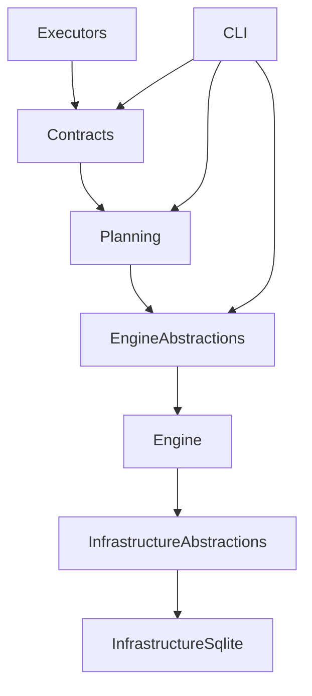

# dxs - Plan-First Execution Engine
**Pre-Release (Architecture-Complete, Feature-Incomplete)**

dxs is a plan-first execution engine. Intent is compiled into a deterministic `ExecutionPlan`, and only the Engine is allowed to execute that plan. Architecture rules and tests make invalid execution paths unrepresentable.

This repository represents the first pre-release milestone. The layering, reference rules, and audit-commit gate are implemented and enforced. Feature coverage is intentionally limited.

---

## What dxs Is

- A deterministic execution kernel
- A compiler-style pipeline for workspace change
- Built on explicit authority, not convention
- Designed for auditability and replay

## What dxs Is Not

- A general scripting tool
- A shell replacement
- An orchestration framework
- An imperative runtime

If you need ad-hoc flexibility, dxs is the wrong tool. If you need execution that is explainable and reproducible by construction, dxs is designed for that.

---

## Core Concept

Input does not execute. Plans execute.

```
DX Document + HeadState
  ->
ExecutionPlan (pure, deterministic)
  ->
Engine (single authority)
  ->
DxResult
```

No CLI, executor, or helper may bypass this pipeline.

---

## Architecture Overview



- Contracts define the protocol
- Planning is pure
- Engine is the only execution authority
- Executors are isolated
- Infrastructure is abstracted

---

## Authority Model

These rules are enforced by build and tests:

- Only the Engine executes (SOP-REF 3.1)
- Only `ExecutionPlan` crosses boundaries (SOP-REF 2.1)
- Executors are isolated and capability-scoped (SOP-REF 4.2)
- Infrastructure has no execution authority (SOP-REF 4.1)

Violations fail the build and fail `Dx.Architecture.Tests`.

---

## Repository Status

**Implemented**

- Deterministic planning pipeline
- `ExecutionPlan` and `PlanHash`
- Audit-Commit gate in Engine
- Architecture tests and namespace guards
- Initial file and patch executors
- Plan completeness harness

**Not Yet Implemented**

- Full block type coverage
- Executor plugin model
- CLI ergonomics
- Performance work
- Extended documentation

This is intentional. The core is correct first. Features follow.

---

## Build and Validate

**Prerequisites**: .NET SDK (see `global.json`), PowerShell or bash.

```powershell
dotnet build
dotnet test tests/Dx.Architecture.Tests
```

The architecture tests enforce layering and authority. A green build means the invariants hold.

---

## Documentation

- `docs/SOP.md` - engineering rules
- `docs/ARCHITECTURE.md` - boundaries and authority
- `docs/CONTRIBUTING.md` - contribution workflow
- `docs/dependency-graph.md` - reference graph

Architecture Decision Records (ADRs) will be added under `docs/adr/` as decisions land.

---

## Contributing

Contributions must preserve invariants. Expect review questions on authority, determinism, and whether a change belongs in planning or execution. See `docs/CONTRIBUTING.md`.

---

## Status Note

Treat this pre-release as an architectural foundation, not a finished tool. The direction is a compiler-grade engine for auditable, replayable change.
