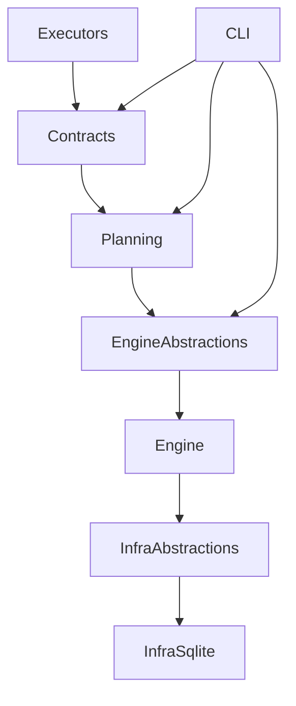

# dxs — Plan-First Execution Engine

dxs is a **plan-first execution engine** that enforces **structural impossibility guarantees** through architecture, build rules, and tests.

## 30-Second Architecture



## Authority Model

* Only **Engine** executes (SOP-REF 3.1)
* Only **ExecutionPlan** crosses boundaries (SOP-REF 2.1)
* Executors are **isolated** (SOP-REF 4.2)
* Infrastructure is **abstracted** (SOP-REF 4.1)

## Run

```bash
dotnet build
dotnet test tests/Dx.Architecture.Tests
```

## Links

* [ SOP ](./SOP.md)
* [ Architecture ](./ARCHITECTURE.md)
* [ ADRs ](./adr/)
* [ Contributing ](./CONTRIBUTING.md)
